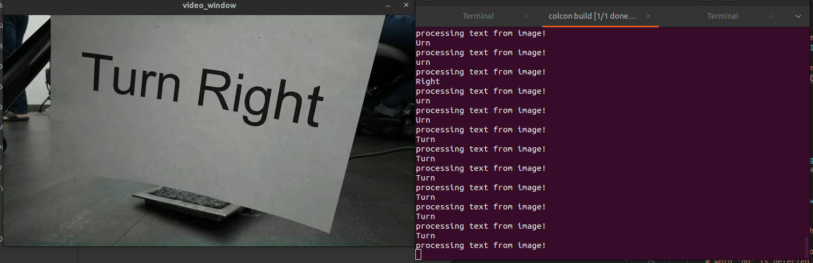

# OCR
Robot direction-taking with OCR for ROS2.\
[Install instructions](##install-instructions)
## Features
### Optical Character Recognition
Our package establishes a live video feed to a capable machine and converts any words in the image to text.

### Sign Following
Our package enables our robot to follow instructions written on signs around a space, enabling it to travel to different locations and complete missions!
```python
ros2 run neaocr follow_directions
```
Enables the following features:
1. Turn Left: the robot will turn 90 degrees clockwise
2. Turn Right: the robot will turn 90 degrees counterclockwise
3. Go: the robot will travel forward at 50% speed for 3 seconds
4. Stop: the robot will stop angular and linear travel.
5. Back Up: the robot will travel backwards for 3 seconds.


## Goal of Project
The stretch goal of this project was to get a Neato to be able to recognize text directions posted on signs on walls throughout the MAC building and follow them from a starting location to an ending location. The Neato would use its onboard camera and built-in LiDAR sensors to locate and interpret instructions and navigate.

We wanted to use (or make) a text recognition algorithm for processing written text. The text would be simple commands like “Go straight” or “Turn at the next corner”. The Neato would then, if we had time to program it, use its LiDAR sensor to detect the next corner or other necessary local obstacles in order to get from a starting point to an ending point.

The MVP that we aimed for was having a Neato be able to read and follow basic instructions held in front of it (“Go”, “Stop”, “Turn Right”, “Turn Left”, “Move Backwards”). We achieved this goal. More details in [Features](##features)

## How we Solved the Problem
We decided to use an existing open source Optical Character Recognition package called EasyOCR. The package has the capability to recognize text from images in 80+ languages.

We created a ROS2 package called neatocr, which contains 2 primary nodes: read_sign, and follow_directions. read_sign establishes a subscription to the camera on the Neato. We take an image from the camera, run EasyOCR on it to see if there is any text to be found in the image, and then repeat the process. The latency of the EasyOCR package is about 3 seconds when there is no or minimal text in an image, and we use this as a timer for how often we pull images from the camera.

The EasyOCR algorithm returns a list of nested arrays of the location of any text found as well as the text itself. If text is found, we save it, and publish it to be picked up by the node follow_directions.

In follow_directions, we process the found text and check to see if there is any text relevant to the Neato - primarily, the phrases “Turn right,” “Turn left,” “Go,” “Stop,” or “Back up”. After interpreting this text, velocity commands are sent to the Neato to follow these directions.


## Design Decisions
We decided to use EasyOCR, an open-source text recognition software, instead of building one from scratch. This gave us the opportunity to delve more into the real-world application and integration of an existing computer vision algorithm with ROS2 as our architecture, as opposed to the logic of the algorithm itself. We focused on learning how to use an existing package with ROS2 threads, and this also allowed us to use the OpenCV pipeline on our robot. 

## Challenges
The main challenges we encountered during this project included dealing with random bugs, mostly unrelated to the actual algorithm we were trying to use. These made up the largest time sinks throughout the project. The bugs were related to discrepancies in software versions, accidental duplicate installations of OpenCV, and other seemingly minor things that set us back several hours. This did teach us that sometimes trying to integrate different software packages can be the hardest part of a project.

It also took us a lot of time to work through understanding the data types and formats being used and returned by the EasyOCR package. We had never used the EasyOCR package before, and documentation on the expected args and returns of the main package features was limited. We spent significant time debugging by checking which data types were passed from function to function. For future reference, the NeatOCR reader.readtext() function outputs data as a list-of-lists.

## Improvements
Given more time, we would like to enable the ability to follow more complex instructions, such as “take the next left”, or “stop at the far wall”, so that the Neato can actually drive through the MAC. This would require using LiDAR scan data from the Neato. Using the LiDAR data, we would need to write code for localizing/mapping the surroundings of the Neato, and for recognition of certain landmarks. We would algorithmically answer questions like, "What is a corner?", or "What location is the instruction 'go to the far wall' referring to?" before the Neato could drive through the relatively complex environment of the MAC.

In addition, to account for environments that are noisy with existing signs (posters, road signs etc.), it could be helpful to use an image filtering algorithm to identify relevant text. One way to do this is to print signs in a specific color (i.e. green), and use color filtering to filter out any other colors before using the EasyOCR algorithm to look for text.

## Lessons
Throughout our development process, we found it to be effective to work on a problem slowly but steadily, in small chunks. This is in reference to both time and complexity. A large problem can be made manageable by breaking it into smaller, simpler chunks and building it up slowly. A dauntingly long project can be finished through a series of focused hour or two-hour long sessions.

We also discovered how useful it is to reuse existing algorithms and packages. This project gave us the experience of identifying what we needed for our algorithm, looking for a compatible existing package, and implementing it for our own use. This is a skill that is very relevant to most robotics programming projects, and will be useful to us in the future.

Directly related to optical character recognition, we learned that latency of OCR generally scales linearly depending on the amount of text. This has implications on its use in different applications - for example, in the case of character recognition used on road signs in self-driving cars, the algorithm must function fast enough for a car to react in real time while traveling at 10~60 mph.

## Install Instructions
### Install EasyOCR
```bash
pip install easyocr
```
If troubleshooting you may want to use these [Install Instructions](https://github.com/JaidedAI/EasyOCR/tree/master#installation). 

### Install OpenCV
If you are confident you have one, stable release of OpenCV 4.x installed on your machine you can skip these steps.

```bash
pip uninstall easyocr
sudo apt update && sudo apt install -y cmake g++ wget unzip
# Download and unpack sources
wget -O opencv.zip https://github.com/opencv/opencv/archive/4.x.zip
unzip opencv.zip
# Create build directory
mkdir -p build && cd build
# Configure
cmake  ../opencv-4.x
# Build
cmake --build .
```
Which come from [OpenCV 4.x](https://docs.opencv.org/4.x/d7/d9f/tutorial_linux_install.html)'s install instructions.

### Install prerequesites
```bash
sudo apt-get update && sudo apt-get install -y ros-humble-gazebo-ros-pkgs \
	ros-humble-nav2-bringup \
	ros-humble-navigation2 \
	ros-humble-camera-info-manager \
	ros-humble-cartographer-ros \
	ros-humble-cartographer \
	ros-humble-gscam \
	git \
	python3-colcon-common-extensions \
	gstreamer1.0-plugins-good \
	gstreamer1.0-plugins-bad \
	gstreamer1.0-plugins-ugly \
	gstreamer1.0-libav gstreamer1.0-tools \
	gstreamer1.0-x \
	gstreamer1.0-alsa \
	gstreamer1.0-gl \
	gstreamer1.0-gtk3 \
	gstreamer1.0-qt5 \
	gstreamer1.0-pulseaudio \
	python3-pip \
	hping3
```
Create a ROS2 workspace and download our dependencies.
```bash
source /opt/ros/humble/setup.bash
mkdir -p ~/ros2_ws/src
cd ~/ros2_ws/src
git clone https://github.com/comprobo23/neato_packages
cd ~/ros2_ws
colcon build --symlink-install
source ~/ros2_ws/install/setup.bash
```

### Clone our package
```bash
cd ~/ros2_ws/src
git clone git@github.com:cjhi/OCR.git
```

### Connect to a neato using neato2_node bringup packages
First, make sure you are able to connect to the 
```bash
ros2 launch neato_node2 bringup.py host:=IP_OF_ROBOT
```

neato2_node is based on [neato_driver](https://wiki.ros.org/neato_driver) and [neato_ros2](https://wiki.ros.org/neato_driver) packages.

### Run neatocr packages
```bash
ros2 run neatocr read_sign.py
ros2 run neatocr follow_instructions.py
```
Now the Neato will read directions found on signs to the terminal, and follow those directions in real time!


